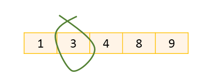
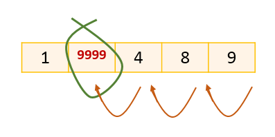
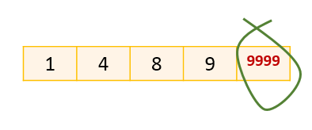
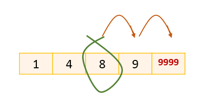
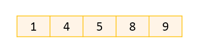

# Introduction to Data Structures
## Prerequisites
Before starting this lesson, you should have already learned:
1. [Arrays](Arrays.md)
1. [Efficiency of Algorithms](Efficiency%20of%20Algorithms.md)

### Study of data structures - What and Why
A common problem in Computer Science is managing large amounts of data and performing different operations on them. **Data Structures** provide different well-known ways to organize data. Each data structure follows its own set of rules on how the data should get organized. The study of data structures is to understand these rules. Alongside these governing rules, we are also looking to understand how different common operations like insert, delete and search work on each of these data structures and understand the average and worst case efficiency for the common operations. Knowledge of well-known data structures allows us come up with optimal designs to our real world, practical coding projects.

#### Why not just Arrays?
While studying the [Array data structure](Arrays.md), we learned that arrays are:
1. <b>static data structures</b>: once created the size of an array is fixed.
1. <b>homogenous data structures</b>: all elements/items in an array are of the same type e.g. an array of integers, an array of strings etc.
1. <b>allocated in contiguous block of memory</b>: all elements in an array take up space right next to another element in the array in a linear manner such that the array element at index `i + 1` is next to the array element at index `i` and the array element at index `i + 1` is always at a higher address than the array element at index `i`.
1. <b>linear data structure</b>: arrays begins at one end and all elements are logically (and physically) laid out in the structure of a _line_.

We looked at several methods on the array data structure and understood how indexing is a very quick operation (_O(1) time complexity_). There are several benefits to maintaining a list as an array, especially if we can keep the array sorted.

However, the biggest challenge with arrays is that they are <b>static</b> data structures. 
- This means we <b>need a good assessment of the upper bound</b> how many entries we will need in the array. e.g. Consider that a class of 48 students is invited to a party. Then, we can safely assume that at the most 48 students will show up to the party and create an array of size 48. What if we allowed the students to forward the invite to any other friends? There is no way of keeping track of how many people received the invite and hence, no idea of the upper bound that we could use to create an array.
- Let's say we had a good assessment of the upper bound and were able to create an array. Then, our next challenge is <b>how do we keep track of unused space in the array?</b> Typically, engineers employ a _convention_ to keep track of the unused spaces in the array. The _conention_ typically is to have a special reserved value to identify unused spaces.
- Even after leveraging a convention to track free spaces, <b>additions and deletions</b> are the most cumbersome operations in an array due to its static nature. Let's consider an example:
    - Consider a sorted integer array of size 5, and let's say we wanted to delete a particular value from it e.g. 3.

    

    - As we delete this value, we want to keep the array sorted. Our special reserved value is a high integer value, let's say 9999 to indicate unused space. Having this special reserved value in the middle will make all our other algorithms cumbersome since they will need to check for the special case before reviewing any value in the array. Hence, we typically keep all special reserved values towards the end of the array. This means, on delete we move all valid values forward by one.

    

    - This way, the sorted array is no longer _fragmented_ by special reserved values in between valid values. All unused space in the array is kept at the end.

    

    - Overall, the time complexity for delete in our sorted array example, using conventions for free, unused space is _linear_ or _O(n)_, where _n_ is number of elements in the array.
    - Before we consider any additions to the array, we first need to ensure that there is space available in the array for one more value. Since the convention is to keep all unused spaces in the end, we can verify if there is a space available for adding one more item by checking if the value at the last index into the array is the special reserved value to indicate unused space.
    - If there is at least one space available, we can add a new valid value into the array. Because we want to keep the values sorted, we search linearly to find out where the new value should be inserted. Once we find the location, we move forward all valid values that follow the location by one. e.g. consider adding 5 to our current example array.

    

    - You'll notice that similar to the delete operation, the insert operation also has a time complexity of _linear_ or _O(n)_, where *n* is the number of elements in the array.

    

In conclusion;
- If the amount of data we will need to save is unclear and we do not have a clear idea of the upper bound, arrays would waste a lot of memory due to unused space or be space inefficient in meeting the needs of our data organization.
- If insertions and deletions are going to be frequent operations on our data set, then an array data structure will be time inefficient in fulfilling the needs for our data organization.

Therefore, it behoves us to consider another data structure like a <b>linked list</b> which is a <b>logically linear</b>, <b>logically homogenous</b> and <b>dynamic</b> data structure. We'll learn more about linked lists in a later lesson.

### How to approach the study of data structures
Each of the data structures follow _different rules that allow us to achieve certain intents_. e.g. a **Stack** data structure is a _linear_ data structure where all additions and all deletions must occur at one end, known as the _top_. This restriction makes it so that the data structure will always first return the last item that was inserted. This property makes it so that stack becomes the optimal data structure of choice to design the _collate_ functionality in a printer's software. This is what allows for the last page to be printed first, the next to last and so forth so that the final output of printed pages appear in the correct order. As we'll see in future lessons, the *stack* design get used in how method calls work on a computer to form the *call stack*.

Each of the different ways of organizing the data _optimizes certain operations on the data_. For instance, as we saw [earlier](#Why-not-just-Arrays?), array data structure is very efficient in retrieving the value of an element at a particular index with O(1) time complexity. However if the number of elements are going to change often due to frequent additions and deletions, Arrays are cumbersome to work with. If additions and deletions are going to be frequent operations and those operations being efficient is more important than retrieving the *k*th item in the data structure, then a **Linked List** would provide a better choice than Array data structure. _Knowing which operations a given data structure optimizes for and which operations are cumbersome or expensive on the data structure will allow you to choose the right design for your purpose._

Some data structures are _specialized versions of other data structures_. For example, a **graph** is a _non-linear_ data structure consisting of a finite set of _nodes_ and _edges_. A **tree** is a _connected_, _acyclic_ graph where one node is ditinguished as the _root_ of the tree and all other nodes are connected by a _directed_ edge from exactly one other node that is known as its parent. The directed edges in a tree connect from a parent node to its children node. A **binary tree** is a specialized form of a tree with the retriction that each node can have at the most two children. A **binary search tree** further retricts a binary tree and allows for sorted organization of data enabling fast searches in expected O(log n) time.

Some data structures could be _implemented using other data strucutres_. For example, a **stack** or a **queue**, can both be implemented using either an array or a linked list. In other words, behind the scenes, a stack or a queue is implemented simply as an array or a linked list with further restrictions added.

## Conclusion
_Knowing which operations a given data structure optimizes for and which operations are cumbersome or expensive on the data structure will allow you to choose the right design for your purpose._ In order to do so, we will continue learning about well-known data structures in computer science.

## Slide Deck
+ Slide Deck used in class 
<a href="https://drive.google.com/file/d/0B__DV26QHsH4NFFtNGc0aWpZWXc/view?usp=sharing">Introduction to Data Structures</a> is licensed under a <a rel="license" href="http://creativecommons.org/licenses/by-nc-nd/4.0/">Creative Commons Attribution-NonCommercial-NoDerivatives 4.0 International License</a>. 
 
