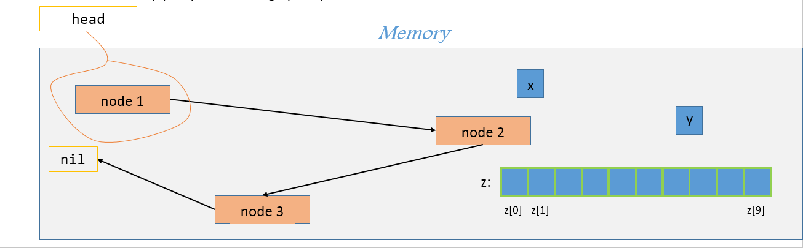
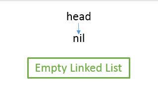
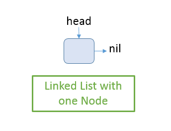
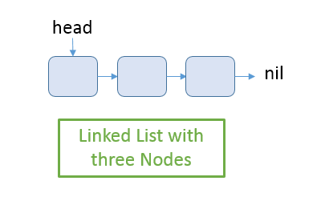
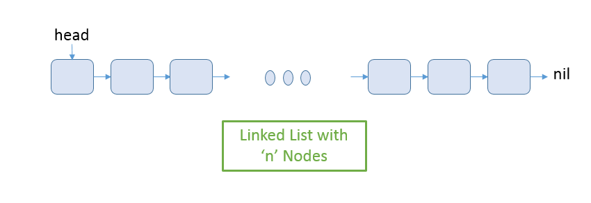

# Linked Lists
## Goals
+ Singly linked list
+ Doubly linked lists
+ Design using object oriented principles

## Pre-requisites
Before starting this lesson, you should have already learned the following lessons:
1. [Introduction to Data Structures(../classroom/Introduction%20to%20Data%20Structures.md)

## Introduction
<b>Linked lists</b> data structure has the following properties:
- Data is organized in a logically <b>linear</b> way.
- Each element (called _node_) in the linked list has the same structure. As such, linked lists are <b>homogeneous</b>
- Linked list is a <b>dynamic</b> data structure. The size of a linked list changes throughout its lifetime.
- Each _node_ in the linked list could be anywhere in memory, and not necessarily next to each other in a contiguous block of memory.

Here's an imagination of memory showing two integer variables, `x` and `y`, one array of integers of size 10, `z` and a linked list:

Just like `x` is a label for an integer taking up space in memory, `head` is a label for the first node in the linked list. The `head` node may be `nil` or `NULL` to indicate an empty linked list. Otherwise, the `head` is a _reference_ or a _pointer_ to the first node in the linked list. Each node in the linked list contains the data to be saved and a link (i.e. a _reference_ or a _pointer_) to the next node in the linked list.

<b>Thought exercise</b>: When and why would we choose to use a Linked List instead of an Array data structure?

  
 Reasons to consider a linked list instead of an array.
  

    - Allocation: If we don’t know the size requirements ahead of time, linked list would be a better choice. Arrays are static data structures and are hence fixed in size once allocated. To use arrays, we need a good idea of upper bounds for how much data we would need to save. Linked Lists, in contrast, can be dynamically allocated.
    - Frequency of insertion and deletion: As we saw [earlier](../classroom/Introduction%20to%20Data%20Structures.md#Why-not-just-Arrays?), arrays are messy for inserting and deleting. Despite leveraging conventions to avoid fragmented arrays, insertion and deletions in an array are very expensive operations. In contrast, Linked Lists nodes can be anywhere in memory.

**Aside**: If there's sufficient space in memory but not available contiguously, then intutively, we may consider Linked List to be a better choice. However, most systems have a _defragmentation_ program that makes it so all free space is available together and all used space is condensed. Read further on [Defragmentation](https://en.wikipedia.org/wiki/Defragmentation)

## Singly Linked List or Doubly Linked List
The beginning of a linked list is determined by a special link known as the _head_. When the linked list is empty, the _head_ will be _nil_ or _NULL_. In all other cases, i.e. when there is at least one _node_ in the linked list, the _head_ is what we call the _reference_ or the _pointer_ to the first _node_ in the linked list.

### Node
Each _node_ in a linked list contains the information or data that we want to store. In addition, each _node_ links to the adjoining _node(s)_.

In the case of a **singly linked list**, each _node_ holds a link to the **next** _node_. In the case of a **doubly linked list**, each _node_ holds a link to the **next** _node_ and the **previous** node.

The last node in both, singly linked list as well as doubly linked list links to _nil_ or _NULL_. This is how we know that we have reached the end of the linked list.

### Singly Linked List
In the beginning, the linked list would be empty. The _head_ link will return _nil_ or _NULL_.

Once one record of information is added, there will be one node in the linked list. The _head_ will be a reference or a pointer to this node.

Once there are more than one nodes, the head node is a link to the first node, the first node link to the second and so on. The final node links to _nil_ or _NULL_ to indicate the end of the linked list.

## Exercises
Design a <b>singly linked list</b> using object oriented design principles. What class(es) would you need? What are the data members in each class?
Design an algorithm, deduce the space and time complexity and then, author functions to do the following:
For each of the problems below: Assume you are given a singly linked list where each node in the linked list has integer data and a link to the next node.
  1. Add a new node with the specific input data value in the linked list. Insert the new node at the beginning of the linked list
  2. Check if the linked list contains a node with specified input value. Returns true if found, false otherwise.
  3. Return the max value in the linked list. Returns the data value and not the node.
  4. Return the min value in the linked list. Returns the data value and not the node.
  5. Return the count of nodes in the singly linked list.
  6. Return the value of the nth node from the beginning. *n* is the input to the method.
     Assume indexing starts at 0 while counting to n.
  7. Insert a new node with specific input data value, assuming the linked list is sorted in ascending order.
  8. Print the value of each node in the singly linked list separated by a space.
  9. Delete the first node found with the specified input data value.
  10. Reverse the singly linked list. The nodes should be moved and not just the values in the nodes.
  11. Returns the value at the middle node in the singly linked list.
      If the node count is even, pick one of the two middle values to return.
  12. Find the nth node from the end of the linked list and return its value. Assume indexing starts at 0 while counting to n.
  13. Check if the linked list has a cycle. A cycle exists if any node in the linked list links to a node already visited. Returns true if a cycle is found, false otherwise.

## Slide Deck
+ ## Slide Deck
+ Slide Deck used during classroom time 
<a href="https://drive.google.com/file/d/0B__DV26QHsH4TnUzdU4zWF85S1k/view?usp=sharing">Introduction to Linked Lists</a> is licensed under a <a rel="license" href="http://creativecommons.org/licenses/by-nc-nd/4.0/">Creative Commons Attribution-NonCommercial-NoDerivatives 4.0 International License</a>. 
 
+ Slide Deck used in internship time 
<a href="https://drive.google.com/file/d/0B__DV26QHsH4bFczWXBXdGtHYkE/view?usp=sharing">Linked Lists</a> is licensed under a <a rel="license" href="http://creativecommons.org/licenses/by-nc-nd/4.0/">Creative Commons Attribution-NonCommercial-NoDerivatives 4.0 International License</a>. 
 
